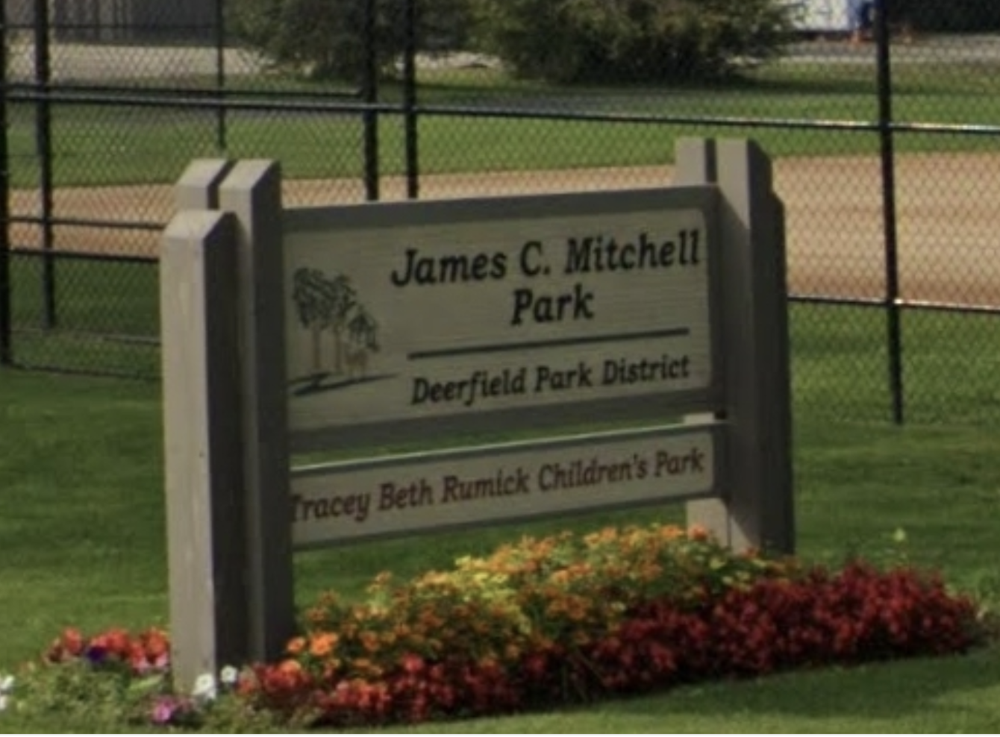

## Rise of the Suburbs + Sundown Towns
_Ruby Werman_

The growth of the suburbs after World War II transformed the landscape of the United States. Using benefits from the G.I bill, more Americans were able to afford houses, college, and start living the “American Dream.” However, suburbs only provided this dream for upper and middle class white Americans. 

These suburbs are called Sundown towns, which means they use discriminatory laws, intimidation, and violence to enforce racial segregation. The term Sundown town comes from the signs posted in these communities warning African Americans to leave before sundown. Sundown towns are a product of White Flight. As neighborhoods became more racially diverse, white Americans migrated to suburbs.

 
 
 _Source: A Parallel Road_
  
I was particularly interested in Sundown towns because of their proximity to my hometown in the northern suburbs of Chicago. In fact, my town is adjacent to a prominent former Sundown town, Deerfield, Illinois. 

Deerfield made national headlines in November of 1959 when residents resisted a housing development that planned to sell homes to black and white buyers.This controversy ignited a national discussion about the suburban housing boom and integration. The development corporation, Progress Development Corp., filed a civil rights suit against town officials for blocking progress. Martin Luther King Jr. spoke on the issue encouraging integration, and Elanor Roosevelt visited Deerfield and commented that “Deerfield is the Little Rock of housing” (Deerfield Public Library). 

Deerfield residents succeeded in blocking the housing development and a park was built instead. A park I grew up playing soccer at. 

 _Source: Deerfield Patch_

It’s no surprise that youth soccer is a popular sport in the suburbs of Chicago. After all, youth soccer thrives in affluent suburban neighborhoods. Suburbs have an abundance of fields and parents available to volunteer, coach, and drive their kids to practice (Johnson, 1985). It’s clear that suburban parents are engaged in their childrens’ extracurriculars. This can be attributed to their wealth– most of these suburban mothers don’t need to work to support their family. Hence the term “soccer mom,” which was popularized in the 1996 presidential elections to describe the demographic of married, suburban, upper/middle class women. 

The continued growth of suburbs following the initial White Flight 1960s, 1970s, and 1980s can be attributed to the desegregation of public schools and neoliberal policies that pushed white families out of cities. 

As wealthy families moved out of cities, so did their tax dollars. This change led to stark inequalities within park districts and public schools in urban and suburban areas. Simms and Talbert describe this as follows: 

*Whites’ decisions about where to live and their control of local governments in the communities in which they reside enable them to reproduce racial residential segregation and their preference for majority-White schools without enacting race-specific laws (Simms, A. & Talbert, E., 2019).*

Property taxes are the primary source of funding for school districts. In Illinois, property taxes account for around two-thirds of overall funding (Benoit, 2021). This means that higher-valued areas will have better access to resources. Specifically, redlined neighborhoods and sundown towns will receive more funding than diverse urban areas. 

The focus on soccer in suburban areas is partially fueled by the desire for college scholarships. As states cut education funds, parents step into a larger role in the college admissions process. One way is to invest in club sports and extracurriculars that may lead to a scholarship. 

An extreme example of this parental interference is the 2019 college admissions bribery scandal, code named Operation Varsity Blues. A former University of California, Los Angeles soccer coach was sentenced to eight months in prison after taking $200,000 in bribes to help two students secure false spots on the soccer team (Raymond, 2021). This gross display of wealth is the outcome of extreme wealth inequality and the disastrous state of the United States education system. 

The wealth inequality and defunding of public schools has perpetuated soccer's reputation as a pay-to-play, white sport. More funding and affordable housing is necessary to transform soccer in the United States to the sport that is loved and appreciated throughout the world. Soccer should be a symbol of equality and opportunity, not SUVs and college bribes. 

### Bibliography:
1. Willett, Amani, and Tiffany Jones. A Parallel Road. Overlapse, 2021. 
2. Johnson, Dirk. “In the Suburbs, Soccer Is Becoming No. 1 Sport.” The New York Times, The New York Times, 25 June 1985, https://www.nytimes.com/1985/06/25/nyregion/in-the-suburbs-soccer-is-becoming-no-1-sport.html. 
3. Simms, A., & Talbert, E. (2019). Racial Residential Segregation and School Choice: How a Market-Based Policy for K-12 School Access Creates a “Parenting Tax” for Black Parents. Phylon (1960-), 56(1), 33–57. https://www.jstor.org/stable/26743830
4. Benoit, Andrew. “Disparities across Districts: How Illinois School Funding Causes Inequities in Learning.” Drops of Ink, 14 May 2021, https://www.lhsdoi.com/22179/features/disparities-across-districts-how-illinois-school-funding-causes-inequities-in-learning/. 
5. Raymond, Nate. “Former UCLA Soccer Coach Gets 8 Months in Prison in U.S. College Scandal.” Reuters, Thomson Reuters, 19 Mar. 2021, https://www.reuters.com/article/us-usa-education-cheating/former-ucla-soccer-coach-gets-8-months-in-prison-in-u-s-college-scandal-idUSKBN2BB2IX. 
6. DeGrechie, Eric. “Park Board Votes to Rename Mitchell Park.” Deerfield, IL Patch, Patch, 20 June 2020, https://patch.com/illinois/deerfield/park-board-votes-rename-mitchell-park. 

## Soccer in Palestine During the First Half of the 20th Century
_Ruby Werman_

The history of soccer in Palestine during the 20th century largely reflects the political, economic, and social conditions of the region. European immigrants brought soccer to Palestine at the end of the 19th century. The game was popularized through missionary schools, some of the earliest being St. George’s School in 1899, Collège des Frères in 1892, and Salesian Schools of Bethlehem and Haifa in 1891 (Khalidi, 2015). The game soon spread to the streets; children would make soccer balls by stuffing leather balls with pieces of cloth. 
 
 
 
 _St. George's football team, Jesusalem, 1923 (Khalidi, 2014)._
  
After the establishment of British rule in 1917, government officials set up a sports club for both Arabs and Jews. The club managed regular cup games, as well as other sports like cricket and tennis. Soon after, Maccabi, the first Zionist sports organization, wanted to establish a soccer association affiliated with FIFA. However, FIFA only allowed associations representing states to become members. This rule led to Maccabi officials inviting Arab teams and Hapoel, an Israeli Jewish sports association affiliated with the Histadrut Labor Federation, to join the Palestenian Football Association (PFA) in 1928. Fourteen Zionists and one Arab delegate participated in the first meeting of the PFA. The sole Arab member was part of the Nusseibeh family and represented the Islamic Sports Club of Jerusalem. However, after this first meeting, his name never appeared again in the directorate’s protocol. The lack of Arab representatives in the PFA reflects the dominance of Zionist voices in the organization. In official PFA games, “ha-Tikva'' was played alongside “God Save the King.” The PFA also enforced systematic ways to ensure that Zionist clubs maintained their majority role, such as making Hebrew the official language and adding the Zionist flag to its logo. Arabs protested the inclusion of the Zionist flag. In January 1925, the Arab Palestenian newspaper Falastin reported a protest by the Muslim-Christain Association regarding the flying of a Zionist flag at a football match in Jerusalem. The protestors claimed that the flag violated an ordinance against the flying of “the flag or emblem of any State … for the purpose of any partisan demonstration” (Khalidi, 2015). Additionally, Arab Palestenian players boycotted the Palestine National Team. When Palestine joined FIFA in 1929, a report noted that there were sixty-nine teams in Palestine, with eleven of them being Arab (Fillastin, 1945). 

By 1934, the Arab clubs left the PFA to start the General Palestininan Sports Association (PSA). This new organization fostered a sense of national pride among Arabs. In May 1935, the association hosted a large sports event in Jaffa with over 5,000 athletes. The Arab flag was displayed at competitions, and youth sports teams were named after famous Muslim and Arab military commanders like Khaled Ibn al-Walid and Salah al-Din (Fillastin, 1945). However, this representation of Arab athletes ended with the Arab rebellion against the British Mandatory government in 1936. After the PFA disbanded, Arab players had no teams to play for. Some Arab teams requested to rejoin the Jewish league in 1941, but they split once again in 1943. In 1944, Arabs tried to revive the PFA by creating a new organization called the General Palestinian Sports Association (GPSA). By 1945, the General Palestinian Sports Association created a soccer league that banned Jewish players. Arab elites used these sporting events to promote themselves and their political careers. For instance, Ahmad Hilmi Basha, a member of the Arab Higher Committee and a member of the Istiqlal Party, funded the first Palestenian Soccer championship match (Khalaf, 1991). Additionally, much like we saw in England, GPSA match profits were often donated to war victims. The GPSA also tried to play on the international level. However, the PFA, who was in FIFA at the time, refused to play any national team that also played the GPSA, meaning that the PSA’s options were limited. Thus, the GPSA mainly played other neighboring Arab countries like Syria, Jordan, and Lebanon (Sorek, 2003). 

_Fillastin Newspaper, March 24 1925, Source: The National Library of Israel_

_… the imagined community of millions seems more real as a team of eleven named people. The individual, even the one who only cheers, becomes a symbol of his nation himself (Hobsbawm, 1992)._

In the quote above, Hobsbawm emphasizes the importance of national identity through sports. In 20th century Palestine, this phenomenon rang true. The emergence of Zionist-dominated soccer associations represented the surge of Zionist nationalism in Palestine at that time. The majority Zionist national team represented a new era for Palestine. Further, the lack of Arab representation demonstrated the systemic oppression of Arabs politically, economically, and socially. Even more, the PFA represented the suppression of the Arab-Palestenian national identity. While Zionists controlled the PFA, Arabs remained on the fringes. In fact, some Arab players even downplayed their nationalism to play unoticed in Zionist leagues. The new sports initiatives led by Arabs symbolized their attempt to regain a sense of identity. However, the PSA and GPSA's shortcomings indicate the Arab Palestinians' failure to nation-build on the level of Zionist Palestine. 

### Bibliography:
1. Khalidi, Issam. "Coverage of sports news in Filastin, 1911-1948." Soccer in the Middle East, Routledge, 2015.
2. Khalidi, Issam. Sports and Aspirations: Football in Palestine, 1900– 1948. Jerusalem Quarterly #58, Spring, 2014.
3. Fillastin, 17 June 1945.
4. Fillastin, 17 May 1945.
5. Hobsbawm, E. J. (Eric J.). Nations and Nationalism Since 1780: Programme, Myth, Reality. Cambridge University Press, 1992.
6. Khalaf, Issa. Politics in Palestine: Arab Factionalism and Social Disintegration, 1939-1948. SUNY Press, September 1991.
7. Sorek, Tamir. “Palestinian Nationalism Has Left the Field: A Shortened History of Arab Soccer in Israel.” International Journal of Middle East Studies 35, no. 3 (2003): 417–37. http://www.jstor.org/stable/3880202.
