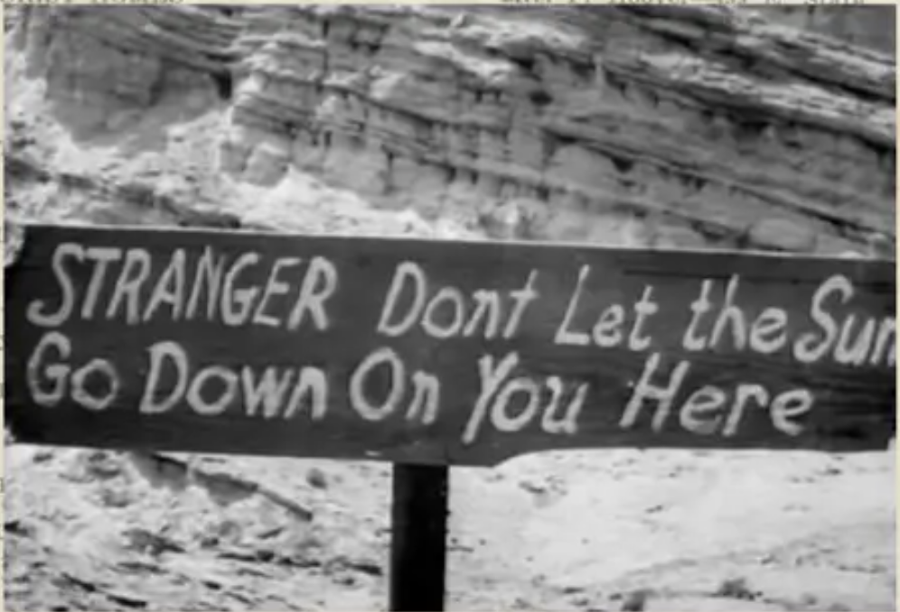

## Rise of the Suburbs + Sundown Towns
_Ruby Werman_

The growth of the suburbs after World War II transformed the landscape of the United States. Using benefits from the G.I bill, more Americans were able to afford houses, college, and start living the “American Dream.” However, suburbs only provided this dream for upper and middle class white Americans. 

These suburbs are called Sundown towns, which means they use discriminatory laws, intimidation, and violence to enforce racial segregation. The term Sundown town comes from the signs posted in these communities warning African Americans to leave before sundown. Sundown towns are a product of White Flight. As neighborhoods became more racially diverse, white Americans migrated to suburbs.

 
 
 _Source: A Parallel Road_
  
I was particularly interested in Sundown towns because of their proximity to my hometown in the northern suburbs of Chicago. In fact, my town is adjacent to a prominent former Sundown town, Deerfield, Illinois. 

Deerfield made national headlines in November of 1959 when residents resisted a housing development that planned to sell homes to black and white buyers.This controversy ignited a national discussion about the suburban housing boom and integration. The development corporation, Progress Development Corp., filed a civil rights suit against town officials for blocking progress. Martin Luther King Jr. spoke on the issue encouraging integration, and Elanor Roosevelt visited Deerfield and commented that “Deerfield is the Little Rock of housing” (Deerfield Public Library). 

Deerfield residents succeeded in blocking the housing development and a park was built instead. A park I grew up playing soccer at. 

It’s no surprise that youth soccer is a popular sport in the suburbs of Chicago. After all, youth soccer thrives in affluent suburban neighborhoods. Suburbs have an abundance of fields and parents available to volunteer, coach, and drive their kids to practice (Johnson, 1985). It’s clear that suburban parents are engaged in their childrens’ extracurriculars. This can be attributed to their wealth– most of these suburban mothers don’t need to work to support their family. Hence the term “soccer mom,” which was popularized in the 1996 presidential elections to describe the demographic of married, suburban, upper/middle class women. 

The continued growth of suburbs following the initial White Flight 1960s, 1970s, and 1980s can be attributed to the desegregation of public schools and neoliberal policies that pushed white families out of cities. 

As wealthy families moved out of cities, so did their tax dollars. This change led to stark inequalities within park districts and public schools in urban and suburban areas. Simms and Talbert describe this as follows: 

_… Whites’ decisions about where to live and their control of local governments in the communities in which they reside enable them to reproduce racial residential segregation and their preference for majority-White schools without enacting race-specific laws (Simms, A. & Talbert, E., 2019). _

Property taxes are the primary source of funding for school districts. In Illinois, property taxes account for around two-thirds of overall funding (Benoit, 2021). This means that higher-valued areas will have better access to resources. Specifically, redlined neighborhoods and sundown towns will receive more funding than diverse urban areas. 

The focus on soccer in suburban areas is partially fueled by the desire for college scholarships. As states cut education funds, parents step into a larger role in the college admissions process. One way is to invest in club sports and extracurriculars that may lead to a scholarship. 

An extreme example of this parental interference is the 2019 college admissions bribery scandal, code named Operation Varsity Blues. A former University of California, Los Angeles soccer coach was sentenced to eight months in prison after taking $200,000 in bribes to help two students secure false spots on the soccer team (Raymond, 2021). This gross display of wealth is the outcome of extreme wealth inequality and the disastrous state of the United States education system. 

### Bibliography:Willett, Amani, and Tiffany Jones. A Parallel Road. Overlapse, 2021. 
1. Johnson, Dirk. “In the Suburbs, Soccer Is Becoming No. 1 Sport.” The New York Times, The New York Times, 25 June 1985, https://www.nytimes.com/1985/06/25/nyregion/in-the-suburbs-soccer-is-becoming-no-1-sport.html. 
2. Simms, A., & Talbert, E. (2019). Racial Residential Segregation and School Choice: How a Market-Based Policy for K-12 School Access Creates a “Parenting Tax” for Black Parents. Phylon (1960-), 56(1), 33–57. https://www.jstor.org/stable/26743830
3. Benoit, Andrew. “Disparities across Districts: How Illinois School Funding Causes Inequities in Learning.” Drops of Ink, 14 May 2021, https://www.lhsdoi.com/22179/features/disparities-across-districts-how-illinois-school-funding-causes-inequities-in-learning/. 
4. Raymond, Nate. “Former UCLA Soccer Coach Gets 8 Months in Prison in U.S. College Scandal.” Reuters, Thomson Reuters, 19 Mar. 2021, https://www.reuters.com/article/us-usa-education-cheating/former-ucla-soccer-coach-gets-8-months-in-prison-in-u-s-college-scandal-idUSKBN2BB2IX. 
